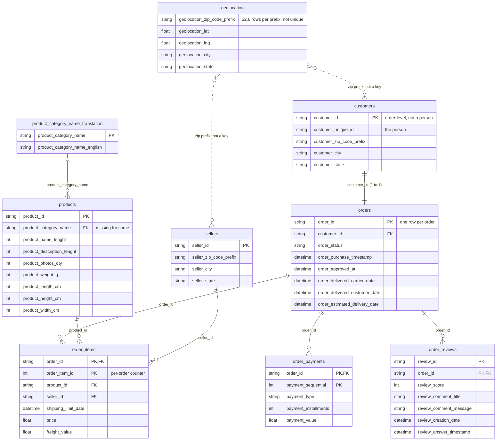

# Olist schema (raw tables)

```mermaid
erDiagram
    customers ||--|| orders : "customer_id (1 to 1)"
    orders ||--o{ order_items : "order_id"
    orders ||--o{ order_payments : "order_id"
    orders ||--o{ order_reviews : "order_id"
    products ||--o{ order_items : "product_id"
    sellers ||--o{ order_items : "seller_id"
    product_category_name_translation |o--o{ products : "product_category_name"
    geolocation }o..o{ customers : "zip prefix, not a key"
    geolocation }o..o{ sellers : "zip prefix, not a key"

    orders {
        string order_id PK "one row per order"
        string customer_id FK
        string order_status
        datetime order_purchase_timestamp
        datetime order_approved_at
        datetime order_delivered_carrier_date
        datetime order_delivered_customer_date
        datetime order_estimated_delivery_date
    }
    customers {
        string customer_id PK "order-level, not a person"
        string customer_unique_id "the person"
        string customer_zip_code_prefix
        string customer_city
        string customer_state
    }
    order_items {
        string order_id PK, FK
        int order_item_id PK "per-order counter"
        string product_id FK
        string seller_id FK
        datetime shipping_limit_date
        float price
        float freight_value
    }
    order_payments {
        string order_id PK, FK
        int payment_sequential PK
        string payment_type
        int payment_installments
        float payment_value
    }
    order_reviews {
        string review_id PK
        string order_id PK, FK
        int review_score
        string review_comment_title
        string review_comment_message
        datetime review_creation_date
        datetime review_answer_timestamp
    }
    products {
        string product_id PK
        string product_category_name FK "missing for some"
        int product_name_lenght
        int product_description_lenght
        int product_photos_qty
        int product_weight_g
        int product_length_cm
        int product_height_cm
        int product_width_cm
    }
    sellers {
        string seller_id PK
        string seller_zip_code_prefix
        string seller_city
        string seller_state
    }
    product_category_name_translation {
        string product_category_name PK
        string product_category_name_english
    }
    geolocation {
        string geolocation_zip_code_prefix "52.6 rows per prefix, not unique"
        float geolocation_lat
        float geolocation_lng
        string geolocation_city
        string geolocation_state
    }
```